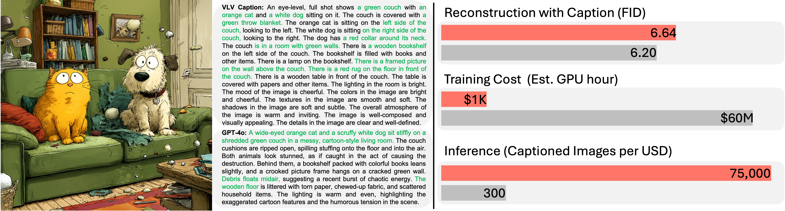

<h1 align="center">VLV-AutoEncoder</h1>

<div align="center">

[](https://lambert-x.github.io/Vision-Language-Vision/)
[](https://arxiv.org/abs/2507.07104)
[](https://github.com/Tiezheng11/Vision-Language-Vision)
[](https://huggingface.co/lambertxiao/Vision-Language-Vision-Captioner-Qwen2.5-3B)
[](https://huggingface.co/datasets/ccvl/LAION-High-Qualtiy-Pro-6M-VLV)


</div>

# Abstract 
We introduce the Vision-Language-Vision (VLV) auto-encoder framework, which strategically leverages key pretrained components: a vision encoder, the decoder of a Text-to-Image (T2I) diffusion model, and subsequently, a Large Language Model (LLM). We establish an information bottleneck by regularizing the language representation space, achieved through freezing the pretrained T2I diffusion decoder.

Our VLV pipeline effectively distills knowledge from the text-conditioned diffusion model using continuous embeddings, demonstrating comprehensive semantic understanding via high-quality reconstructions. By fine-tuning a pretrained LLM to decode the intermediate language representations into detailed descriptions, we construct a state-of-the-art captioner comparable to leading models like GPT-4o and Gemini 2.0 Flash.
<p align="center"></p>


</div>
</details>

## Paper
<b>Vision-Language-Vision Auto-Encoder: Scalable Knowledge Distillation from Diffusion Models</b> <br/>
[Tiezheng Zhang](https://tiezheng11.github.io/)<sup>1</sup>, [Yitong Li](https://openreview.net/profile?id=%7EYitong_Li5)<sup>3</sup>, [Yu-Cheng Chou](https://sites.google.com/view/yu-cheng-chou)<sup>1</sup>, [Jieneng Chen](https://beckschen.github.io/)<sup>1</sup>, [Alan L. Yuille](https://www.cs.jhu.edu/~ayuille/)<sup>1</sup>, [Chen Wei](https://weichen582.github.io/)<sup>2,*</sup>, and [Junfei Xiao](https://lambert-x.github.io/)<sup>1,*</sup><br/>
<sup>1 </sup>Johns Hopkins University,  <br/>
<sup>2 </sup>Rice University,  <br/>
<sup>3 </sup>Tsinghua University,  <br/>
[paper](https://arxiv.org/abs/2507.07104) | [code](https://github.com/Tiezheng11/VLV-AutoEncoder-Official)

## 0. Installation
```bash
git clone https://github.com/Tiezheng11/Vision-Language-Vision.git
```
See [installation instructions](document/INSTALL.md) to create an environment and obtain requirements.

## 1. Dataset Preparation
Please refer to [laion2B-en-aesthetic](https://huggingface.co/datasets/laion/laion2B-en-aesthetic) for dataset preparation. We provide a sub-dataset with 6M image-text pairs on [Hugging Face](https://huggingface.co/datasets/ccvl/Vision-Language-Vision-Dataset).

## 2. Checkpoints
Checkpoints could be downloaded from [Hugging Face](https://huggingface.co/lambertxiao/Vision-Language-Vision-Captioner-Qwen2.5-3B).

## 3. Stage-1 Training: Vision-Language Alignment

### Configuration Options:

```bash
train_dataset_path="./data/Images_6M"          # Path to training images
val_dataset_path="./assets"                    # Path to validation images
run_name="Stage1_Training"                     # Experiment name
lr=5e-5                                        # Learning rate
num_steps=10000                                # Total training steps
save_step=1000                                 # Save checkpoint interval
global_batch_size=64                           # Global batch size across all GPUs
num_gpus=8                                     # Number of GPUs to use
```

### Training Command:
```bash
bash train_stage1.sh
```
## 4. Stage-2 Training: Caption Generation

### Configuration Options:

```bash
epochs=2                                       # Number of training epochs
lr=1e-5                                        # Learning rate
batch_size=8                                   # Batch size per GPU
total_steps=10000                              # Total training steps
dataset_path="./data/Image_384_VL_Captions"    # Path to image-caption pairs
qwen_model="./pretrained_checkpoints/Qwen2.5-3B"  # Path to Qwen model
diffusion_model_path="./pretrained_checkpoints/stage1_checkpoint"  # Stage-1 checkpoint
```

### Training Command:
```bash
bash train_stage2.sh
```
## 5. Inference

The VLV framework supports two types of inference:

### 5.1 Caption Generation
Generate detailed captions for input images using the trained VLV model.

```bash
bash Caption_inference.sh
```

#### Configuration Options:
```bash
IMAGE_PATH="./assets"                          # Input image directory
CKPT_DIR="path/to/stage2/checkpoint"          # Stage-2 checkpoint path
OUTPUT_DIR="./captions.json"                  # Output JSON file
GUIDANCE_SCALE=2.0                            # Guidance scale for generation
NUM_INFERENCE_STEPS=50                        # Number of inference steps
```

#### Output Format:
The script generates a JSON file with the following structure:
```json
{
  "image1.jpg": "A detailed caption describing the image content...",
  "image2.jpg": "Another detailed caption...",
  ...
}
```

### 5.2 Image Reconstruction
Reconstruct images from their learned representations to verify the quality of the information bottleneck.

```bash
bash Image_inference.sh
```

#### Configuration Options:
```bash
# Edit Image_inference.sh to customize inference
IMAGE_PATH="./assets"                          # Input image directory
CKPT_DIR="./pretrained_checkpoints/stage1_checkpoint"  # Stage-1 checkpoint path
OUTPUT_DIR="./reconstructed_images"           # Output directory
GUIDANCE_SCALE=2.0                            # Guidance scale
NUM_INFERENCE_STEPS=50                        # Number of diffusion steps
SEEDS=42                                      # Random seed for reproducibility
```

#### Output:
- **Reconstructed Images**: Generated images from the learned representations
- **Side-by-Side Comparisons**: Original and reconstructed images concatenated
- **Quality Metrics**: FID scores for quantitative evaluation

## 6. Troubleshooting

### Common Issues and Solutions

#### Memory Issues
- **Problem**: CUDA out of memory during training
- **Solution**: Reduce batch size, enable gradient checkpointing, use mixed precision (fp16/bf16), please be aware of the batch size in Stage-1 training.

#### Checkpoint Loading Issues
- **Problem**: `KeyError` when loading Stage-1 checkpoint in Stage-2
- **Solution**: Ensure the checkpoint path points to the correct Stage-1 model directory

#### WandB Issues
- **Problem**: WandB login or API key issues
- **Solution**: Set `WANDB_API_KEY` environment variable or run `wandb login`

#### Dataset Issues
- **Problem**: DataLoader errors or file not found
- **Solution**: Verify dataset paths in configuration files and ensure JSON files exist, please construct dataloader for stage-2 training.

## TODO
- [] Working on Stable Diffusion XL and Stable Diffusion 3.5.

## Citation

```
@article{zhang2025vision,
title     = {Vision-Language-Vision Auto-Encoder: Scalable Knowledge Distillation from Diffusion Models},
author    = {Zhang, Tiezheng and Li, Yitong and Chou, Yu-Cheng and Chen, Jieneng and Yuille, Alan and Wei, Chen and Xiao, Junfei},
journal   = {arXiv preprint arXiv:2507.07104},
year      = {2025}}
```